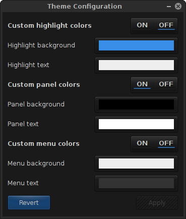
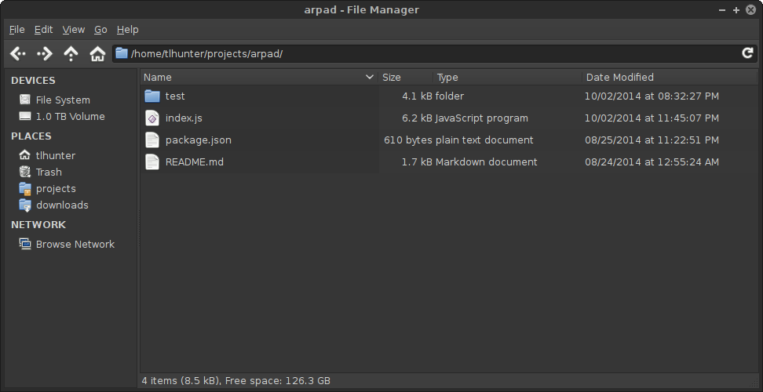
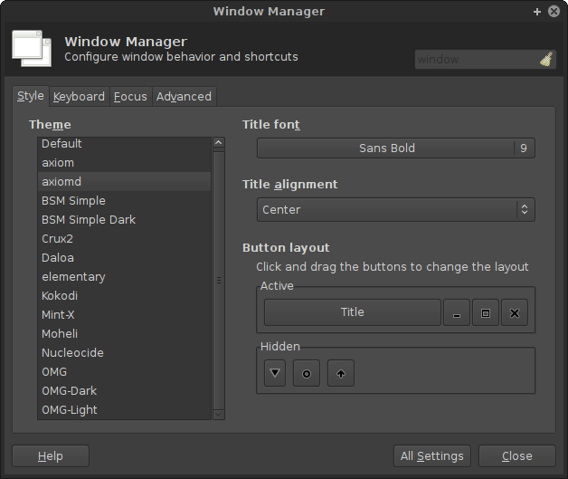
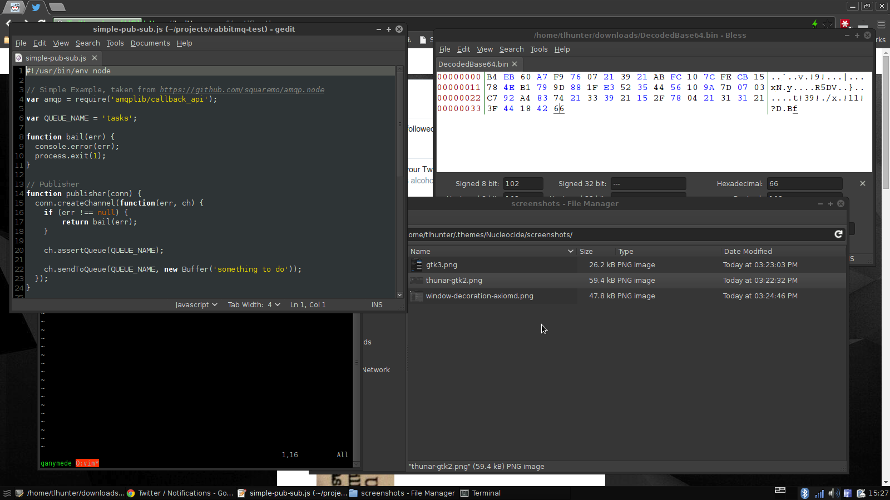

# Nucleocide-GTK

This isn't actually my theme. It is a combination of **BSM Simple Dark**, a GTK2 theme, and **Dorian**, a GTK3 theme.
If you use one theme or the other some of your applications will fall back to an ugly grey system default.

This repo is more or less for my own personal reference.

## Screenshots

### GTK3: Dorian



### GTK2: BSM Simple Dark



### Window Decoration: Axiomd



### Overall Desktop



## Installation

Extract this directory to your themes directory.

```console
$ mkdir -p ~/.themes/
$ cd ~/.themes/
$ git clone git@github.com:tlhunter/nucleocide-gtk.git
# If using XFCE:
$ xfce4-appearance-settings
```
